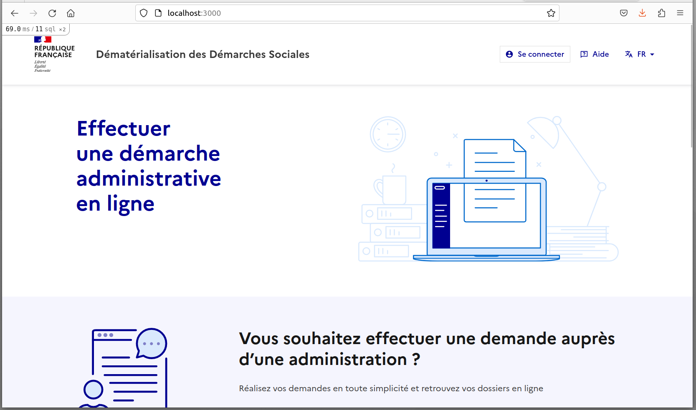
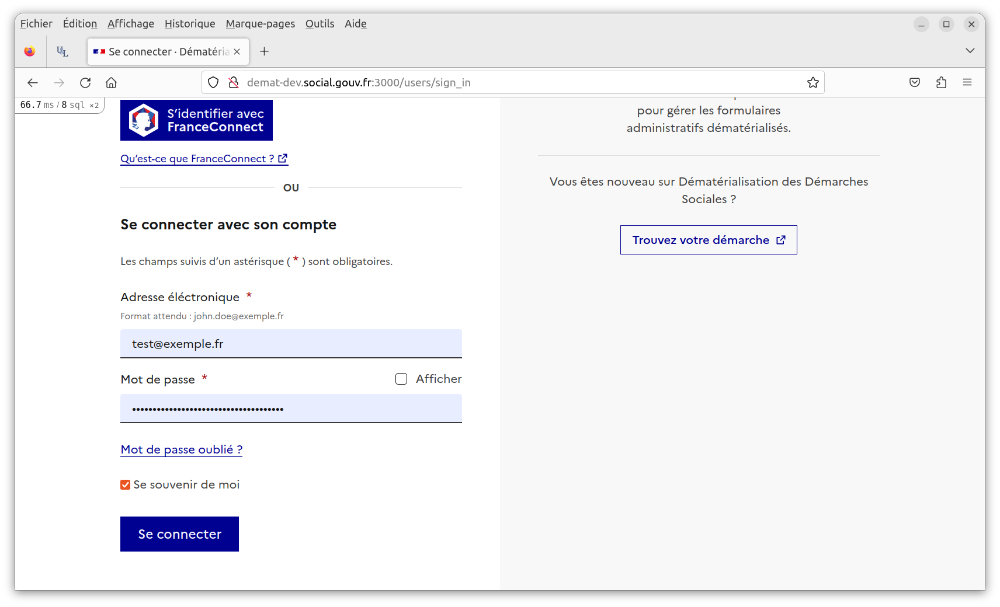
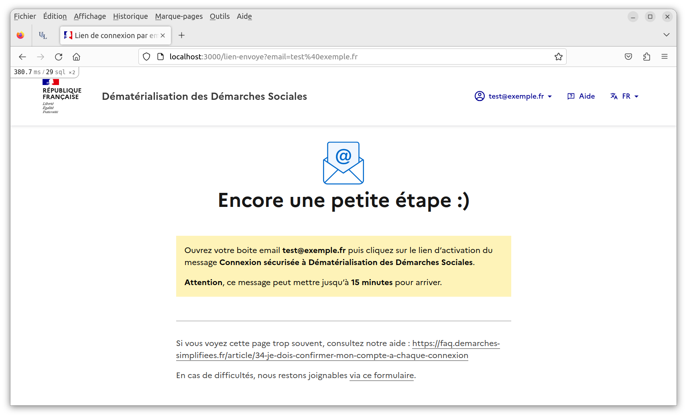
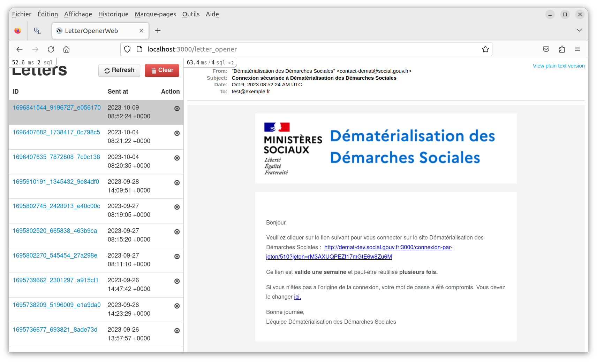
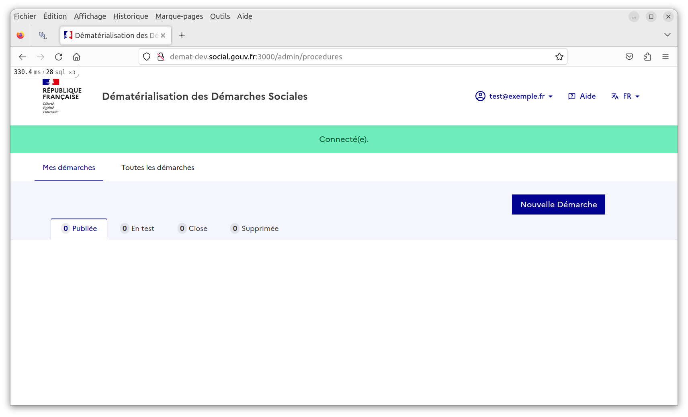

### Le projet demat-social

##### Contexte

Le projet demat-social a été initialement forké du projet [demarches-simplifiees](https://github.com/demarches-simplifiees/demarches-simplifiees.fr).

Le projet demat-social a évolué et se différencie de trois façons distinctes:

  1. En ajoutant des fonctionnalités spécifiques à la DNUM pour une utilisation par les Ministères Sociaux (Santé et Travail) comme par exemple la gestion des données de type NIR (n° de sécurité sociale), rppsante et finess.
  2. En proposant un environnement de développement et de déploiement sous Docker.
  3. En suivant et en ré-intégrant régulièrement les évolutions de la DINUM effectuées sur demarches-simplifiees. Voir à ce sujet les [notes de releases demarches-simplifiees](https://github.com/demarches-simplifiees/demarches-simplifiees.fr/releases).

Un exemple d'utilisation de demat-social est la campagne annuelle de vaccination papillomavirus effectuée par les différentes ARS régionales.

##### Pré-requis

L'environnement de développement du projet demat-social a été testé sous Linux (Ubuntu 22.04.2 LTS), MacOS (BigSur 11.6.8) et Windows 11.

Pour installer le projet il faut disposer des *pré-requis* suivants sur sa machine de développement:

  - un terminal bash (ou compatible)
  - git
  - docker et docker-compose
  - make
  - une connexion réseau internet rapide.

Il est aussi souhaitable de disposer de données représentatives de l'application en production. Pour cela on utilise un *dump anonymisé* de la base de données de production, qui peut-être simplement chargé dans l'environnement de développement. Demander ce dump anonymisé à l'un des membres de l'équipe.

Le dump anonymisé doit s'appeler `production.dump`, être décompressé, et être copié dans un répertoire `../dumps/` à un niveau au dessus du répertoire racine du projet.

```
# Exemple de structure de développement

~/dev $ tree -L 1
.
├── demat-social
├── dumps
└── tmp
```

Il est aussi utile de configurer `/etc/hosts` en y ajoutant la ligne suivante:

```
localhost       demat-dev.social.gouv.fr
```

##### Installation de l'environnement de développement

```bash
# Cloner le projet depuis Github dans votre répertoire de travail.
> git clone --branch main git@github.com:DNUM-SocialGouv/demat-social.git
> cd demat-social

# Créer l'image Docker du projet.
# A ne lancer qu'à la première installation.
> make install

# Charger de la base de donnée anonymisée (voir pré-requis).
# terminal 1 - lancer le serveur de base de données postgresql:
> make dbconsole
# terminal 2 - la restoration du dump prend quelques secondes:
> make restore
# Une fois la restoration terminée, fermer la dbconsole
# dans le terminal 1 avec CONTROL C.

# Lancer l'application demat-social.
# terminal 1:
> make run

# Ouvrir un shell dans le container docker de l'application.
# terminal 2:
> make shell

# Dans le shell du container docker:
# Lancer les migrations de données, ce qui prend quelques minutes.
# La base de données sera migrée de la version de prod 1.9.0
# à la version 2.1.3.
$ ./bin/migrate-data.sh

# Créer l'utilisateur de test:
$ ./bin/rails db:seed
# Les identifiants de l'utilisateur de test sont les suivants:
email:    test@exemple.fr
password: this is a very complicated password !

# Le shell peut-être fermé:
$ exit

# L'application (voir copies d'écran ci-dessous) est disponible sur l'URL suivante:
localhost:3000

# Validater l'utilisateur de test lors de la première utilisation de l'app.
# Ouvrir l'émulateur d'email letter_opener et cliquer sur le lien de validation
# présent dans l'email reçu:
localhost:3000/letter_opener

# Vérifier que les containers fonctionnent correctement.
> make status
./docker/dlist
List of active Docker containers
=============================================================================================
CONTAINER ID   NAMES                STATUS          PORTS
1976d1b0febb   demat-social-app     Up 14 minutes   0.0.0.0:3000->3000/tcp, :::3000->3000/tcp
cfd69a3a4c01   demat-social-front   Up 14 minutes   0.0.0.0:3036->3036/tcp, :::3036->3036/tcp
3179ab5e456f   demat-social-sftp    Up 14 minutes   0.0.0.0:2222->22/tcp, :::2222->22/tcp
668d926e757e   demat-social-data    Up 14 minutes   0.0.0.0:5432->5432/tcp, :::5432->5432/tcp
==============================================================================================

# Arrêter l'application.
# terminal 1: CONTROL C

# Vérifier que les containeurs sont arrétés.
> make status

# Supprimer les containeurs arrêtés.
> make clean

# Redémarrer l'application demat-social.
> make run
```

##### Ecrans de l'application demat-social au démarrage

###### Ecran d'accueil de demat-social 2.1.3


###### Formulaire de connexion de demat-social


###### Demande de validation de l'utilisateur via son email


###### Boite email de l'utilisateur émulée avec letter_opener


###### Première connexion dans l'espace de travail demat-social



##### Autres fonctions utiles fournies par le Makefile


```bash
# Ouvrir un terminal dans le container principal de l'app demat-social,
# quand l'app est à l'arrêt.
> make console

# dans le terminal, lancer une console Rails si besoin:
root@a4c8612441eb:/opt/ds# ./bin/rails c
Running via Spring preloader in process 31
Loading development environment (Rails 7.0.4.3)
[1] pry(main)> Procedure.count
  Procedure Count (0.9ms)  SELECT COUNT(*) FROM "procedures" WHERE "procedures"."hidden_at" IS NULL
=> 165

# Lancer les tâches d'arrière plan (background jobs)
> make workers

# Faire un backup de la base de données dans log/ au format sql
> make dump

# Recharger la dernière archive locale de la base de donnée située
# dans log/backup.sql (générée par un make dump).
# Cette commande supprime et remplace la base de donnée actuelle de
# l'environnement de développement.
> make load

# Recharger la base de donnée à partir du dump de la base de production
# anonymisée présente dans ../dumps/
# Cette commande supprime et remplace la base de donnée actuelle de
# l'environnement de développement.
> make restore

# Reconstruire les images docker.
> make build
```

##### Documentation externe

Documents OneNote qui décrivent notamment le processus de migration Dinum (demarches-simplifiées) vers Dnum (demat-social) ainsi que le benchmarking des exports:

[Migration du 17/04/2023 -01](https://msociauxfr.sharepoint.com/teams/Dmatrialisationdesdmarchessociales/_layouts/15/Doc.aspx?sourcedoc={763bbde3-afae-4f9f-85c5-19266658b82d}&action=edit&wd=target%28R%C3%A9alisation%20%28conception%2C%20d%C3%A9v%2C%20int%C3%A9gration%5C%29.one%7Cf8cdfd4c-fd3d-4b76-9058-4758a54214c4%2FVersion%20du%2017%5C%2F04%5C%2F2023%20-%2001%7Cfcddb1c1-110c-4212-8fbb-800fc4738608%2F%29&wdorigin=NavigationUrl)

[Migration du 07/06/2023 -01](https://msociauxfr.sharepoint.com/teams/Dmatrialisationdesdmarchessociales/_layouts/15/Doc.aspx?sourcedoc={763bbde3-afae-4f9f-85c5-19266658b82d}&action=edit&wd=target%28R%C3%A9alisation%20%28conception%2C%20d%C3%A9v%2C%20int%C3%A9gration%5C%29.one%7Cf8cdfd4c-fd3d-4b76-9058-4758a54214c4%2FVersion%20du%2007%5C%2F06%5C%2F2023%20-%2001%7Cee969558-a074-44bc-8a59-1398e7a7e6e6%2F%29&wdorigin=NavigationUrl)


[Tests de performance des exports](https://github.com/DNUM-SocialGouv/demat-social/blob/test-perf-exports/doc/README-benchmark.md)
